## Tutorial for Assignment 1

Material Link: https://github.com/Elliot-QxZhang/Tutorial

### Personal Introduction

Qixiang ZHANG (Year 2 PhD student)	Supervisor: Prof. Xiaomeng LI	Research Interest: Medical AI, Pathology Image Analysis

>  Office Hour: Thursday 2:00 PM - 3:30 PM at Rm 3117	Email: qzhangcq@connect.ust.hk


### Outline

- Basic knowledge (Python, Numpy, PyTorch)
- A Brief Introduction to Train a Model with PyTorch
- Understanding Medical Data & Preprocess
- Avoid Overfitting
- Details about Assignment 1

### Prerequisite

- Basic knowledge and skills in using Python
- Basic knowledge about deeo neural networks and deep learning


## Basic Knowledge

### Python

- A high-level, dynamically typed programming language.
- Easy to learn.
- Huge community: libraries and frameworks.


### Install Anaconda/Miniconda

Anaconda is a popular **open-source distribution** of the Python that aims to simplify library management and deployment.

Anaconda URL: https://www.anaconda.com/

Miniconda URL (suggested): https://docs.conda.io/en/latest/miniconda.html


### Install Numpy & PyTorch

- PyTorch is a popular deep learning framework
- Numpy is a library designed to manipulate N-dimensional array

```shell
# check for you cuda version
nvidia-smi

# create an anaconda environment
conda create -n tutorial python=3.9

# activate your conda virtual environment
conda activate tutorial

# install Numpy, please check about the compatiable numpy version and pytorch version
pip install "numpy<2.0"

# find the proper pytorch version on https://pytorch.org/get-started/previous-versions/ (example: cuda 11.6)
pip install torch==1.13.1+cu116 torchvision==0.14.1+cu116 torchaudio==0.13.1 --extra-index-url https://download.pytorch.org/whl/cu116
```


### Numpy Tutorial

Doc URL: https://numpy.org/doc/2.1/user/absolute_beginners.html

Numpy is a library designed to manipulate N-dimensional array

- Core Object: ndarry, is a collection of items of the same type (usually numbers, e.g., images, weights, feature maps).

- Numpy contains many useful built-in functions for scientific computation.


#### ndarray Initialization

Doc URL: https://numpy.org/doc/2.1/user/basics.creation.html

```python
# Numpy basics: import, ndarray initialization, shape
import numpy as np

# np.array, shape
vector = np.array([1, 2, 3])

matrix = np.array([[1, 2, 3], 
                   [4, 5, 6]])

tensor = np.array([[[1, 2], 
                    [3, 4]], [[5, 6], 
                              [7, 8]]])

print(f'vector: {vector.shape}\n', vector)
# vector: (3,)
# [1 2 3]
print(f'matrix: {matrix.shape}\n', matrix)
# matrix: (2, 3)
 # [[1 2 3]
 # [4 5 6]]
print(f'tensor: {tensor.shape}\n', tensor)
# tensor: (2, 2, 2)
# [[[1 2]
#  [3 4]]
# [[5 6]
#  [7 8]]]

# other initialization functions
# create ndarray with all element set to zero, parameter: shape
print('np.zeros\n', np.zeros([2, 3]))
# np.zeros
# [[0. 0. 0.]
# [0. 0. 0.]]

# create ndarray with all element set to one, parameter: shape
print('np.ones\n', np.ones([2, 3]))
# np.ones
# [[1. 1. 1.]
# [1. 1. 1.]]

# create ndarray with all element set to a specified value, parameter: shape, filled value (e.g., 3.0)
print('np.full\n', np.full([2, 3], fill_value=3.))
# np.full
# [[3. 3. 3.]
# [3. 3. 3.]]

# create a diagonal matrix, with with ones on the diagonal and zeros elsewhere, parameter: shape
print('np.eye\n', np.eye(4))
# np.eye
# [[1. 0. 0. 0.]
# [0. 1. 0. 0.]
# [0. 0. 1. 0.]
# [0. 0. 0. 1.]]
```


#### Item indexing

Doc URL: https://numpy.org/doc/2.1/user/basics.indexing.html

```python
import numpy as np

tensor = np.array([
    [[ 1,  2,  3],
     [ 4,  5,  6]],
    [[ 7,  8,  9],
     [10, 11, 12]]
])

# index a certain element
print(tensor[0, 1, 2])      # 6

# index several contineous elements
print(tensor[1, 1, :2])     # [10, 11]

# index several separated elements
print(tensor[1, 1, [0, 2]]) # [10, 12]
```


#### Array arithmetic


```python
import numpy as np

x = np.ones([3, 3])
# [[1. 1. 1.]
# [1. 1. 1.]
# [1. 1. 1.]]
y = np.ones([3, 3])
# [[1. 1. 1.]
# [1. 1. 1.]
# [1. 1. 1.]]

## element-wise
print(x + y)
# [[3. 3. 3.]
# [3. 3. 3.]
# [3. 3. 3.]]
print(x - y)
# [[0. 0. 0.]
# [0. 0. 0.]
# [0. 0. 0.]]
print(x * y)
# [[1. 1. 1.]
# [1. 1. 1.]
# [1. 1. 1.]]
print(x / y)
# [[1. 1. 1.]
# [1. 1. 1.]
# [1. 1. 1.]]

# matrix
print(x.dot(y)) # or print(x @ y)
```


#### Broadcasting rules in arithmetic

Doc URL: https://numpy.org/doc/stable/user/basics.broadcasting.html

- Two dimensions are compatible when they are equal or one of them is 1
- General broadcasting rule: matching dimensions **from back to front**

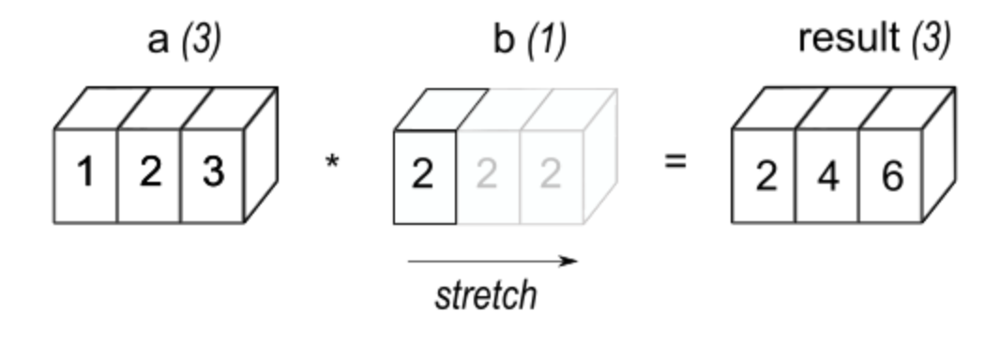

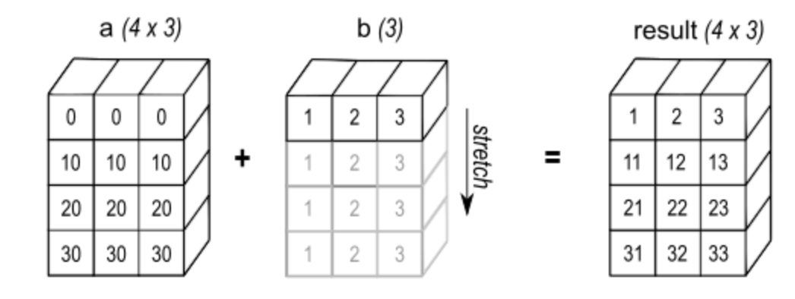

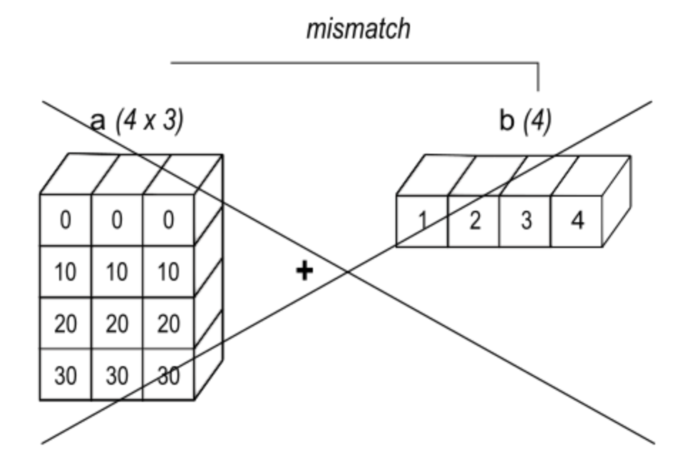


### PyTorch Tutorial

PyTorch is a Popular deep learning framework

- Fast, flexible experimentation

- User-friendly front-end

- Distributed training

- Many tools and libraries


#### Torch tensor creation

Doc URL: https://pytorch.org/docs/stable/torch.html

```python
import torch

# Tensor is the core object of PyTorch, similar to ndarray in Numpy

# torch.tensor ⇔ np.array
a = torch.tensor([[1., -1.], [1., -1.]])

# torch.Tensor.shape ⇔ np.shape
print(a.shape)

# torch.zeros ⇔ np.zeros, dtype: specify the data type stored in tensor
b = torch.zeros([2, 4], dtype=torch.int32)

# torch.ones ⇔ np.ones
c = torch.ones([2, 4], dtype=torch.int32)

# device: which device will this tensor be put into, default: cpu
d_gpu = torch.ones([2, 4], dtype=torch.int32, device=torch.device('cuda'))

# requires_grad: whether to automatically records gradients during 
x = torch.tensor([[1., -1.], 
                  [1., 1.]], 
                 requires_grad=True)
out = x.pow(2).sum() # x^2
out.backward()
print(x.grad) # 2x
# tensor([[ 2., -2.],
#        [ 2.,  2.]])
```


#### Torch Autograd

Doc URL: https://pytorch.org/docs/stable/autograd.html

`torch.autograd` provides classes and functions implementing automatic differentiation of arbitrary scalar valued functions. It requires minimal alternation of the codes, just declare `requires_grad=True` during the initialization of tensor, `autograd` will be enabled.

```python
import torch

a = torch.tensor(3, requires_grad=True)
b = torch.tensor(3, requires_grad=False)

c = 2 * a * a + b  # forward pass
c.backward()       # backward pass, differentiate c on a, and automatically record the gradients

print(c)
print(f'gradient at a: {a.grad}')
print(f'gradient at b: {b.grad}')

# tensor(20., grad_fn=<AddBackward0>)
# gradient at a: tensor(12.)
# gradient at b: None
```

$$
a=3,\\
b=2,\\
c=2a^2+b, \\
\frac{\partial c}{\partial a}|_{a=3}=4a=12
$$


**How did autograd work on deep learning training**

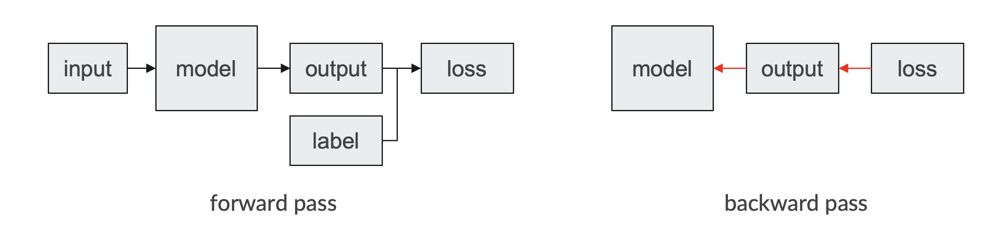

Forward pass: the input is feed into model to generate the output, the output is then used to calculate the loss with the label

Backward pass: we differentiate the loss on the model weights, and generate the gradients

Optimization: we finally optimize the model weights by conducting gradient descendent  


## Training a model with PyTorch

- Step 1: Build a `torch.utils.data.Dataset` and a `torch.utils.data.Dataloader` object (`Dataset` object is used to **read and pre-process** your data, `Dataloader` object is used to **distribute** your dataset into **mini-batch** for each iteration)
- Step 2: Design your model with `torch.nn.module` (input size, output size, forward pass)
- Step 3: Design backward pass: loss function and optimizer

For each iteration: 1. forward pass: compute prediction	2. backward pass: compute gradients	3. Optimization: update model weights


#### Demo datasets: SVHN classification dataset

The **Street View House Numbers** (SVHN) Dataset is a real-world image dataset for object recognition with minimal requirement on data preprocessing

- 10 classes, 1 for each digit. Digit '1' has label 1, '9' has label 9 and '0' has label 10.
- 73257 images for training, 26032 images for testing, and 531131 additional, somewhat less difficult samples, to use as extra training data.
- MNIST-like 32-by-32 images centered around a single character

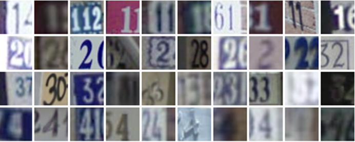

#### Step 1: Build Dataset and Dataloader

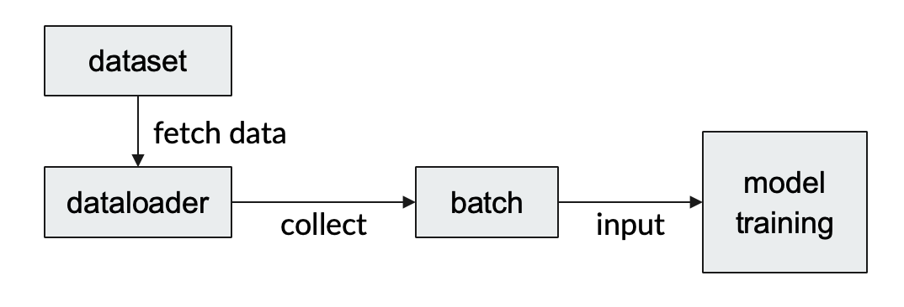

#### Design your dataset

`torchvision.datasets` is a convenient utility for accessing well-known public image and video datasets. (Doc:https://pytorch.org/vision/stable/datasets.html)

`torchvision.transforms` is a package to conduct common image transformations (Doc: https://pytorch.org/vision/stable/transforms.html)

- Usually we combine different transformation function into a chain with `transforms.Compose` function

```python
from torchvision import datasets, transforms

transform = transforms.Compose([
						transforms.RandomVerticalFlip(),
						transforms.RandomHorizontalFlip(),
						transforms.ToTensor(),
						transforms.Normalize(mean=0.5, std=0.5)
])

train_dataset = datasets.SVHN(root="./data/’
                              transform=transform,
                              split='train'
                              download=True
)

test_dataset = datasets.SVHN(root="./data/’
                              transform=transform,
                              split='test'
                              download=True
)
```

An example framework for customed dataset with `torch.utils.data.Dataset` (Doc URL: https://pytorch.org/docs/stable/data.html#torch.utils.data.Dataset)

- To customize your own dataset, you need to overwrite 3 functions: `__init__`, `__len__`, and `__getitem__`

```python
from torch.utils.data import Dataset

class CustomedDataset(Dataset):
  	# surrport dataset initialization
    def __init__(self, data_dir, transform):
        """
        - data_dir: str, directory to the data
        - transform: torchvision.transforms object, image transformation
        """
        self.data_dir = data_dir
        self.transform = transform
        self.data_list = []

        for data in os.listdir(data_dir):
            self.data_list.append(os.path.join(data_dir, data))
                                  
		# support to return the size of the dataset
    def __len__(self):
        return len(self.data_list)
                                  
    # supporting fetching a data sample for a given key                              
    def __getitem__(self, idx):
        # get data path
        data_path = self.data_list[idx]
        
        # read data and label
        data, label = self.read_data(data_path)
                                  
        # transform data
        data = self.transform(data)
        
        return data, label
    
  def read_data(self, path):
        # write your code to read data
        return
```


#### Design your dataloader

After creating a dataset, we need to sample data examples from the whole dataset. Because the computation cost and the reasource limited, we can not feed the whole examples of the dataset into the neuro networks. So we need a way to sample some examples onetime.

`torch.util.data.Dataloader` is a combination of `Dataset` and a sampler, providing an iterable for the whole dataset ([Doc URL](https://pytorch.org/docs/stable/data.html))

```python
# torch.utils.data.DataLoader(dataset, batch_size=1, shuffle=None, sampler=None, batch_sampler=None, num_workers=0, collate_fn=None, pin_memory=False, drop_last=False, timeout=0, worker_init_fn=None, multiprocessing_context=None, generator=None, *, prefetch_factor=None, persistent_workers=False, pin_memory_device='')
from torch.util.data import Dataloader

loader_train = torch.utils.data.DataLoader(
    dataset=train_dataset,
    batch_size=128,
    shuffle=True
)

loader_test = torch.utils.data.DataLoader(
    dataset=test_dataset,
    batch_size=4,
    shuffle=True
)

dataiter= iter(loader_test)
images, labels =dataiter.next()
print(f"images: {images.size()}")
print(f"labels: {labels.size()}, {labels}")

# images: torch. Size([4, 3, 32, 32]
# labels: torch.Size([4]), tensor([1, 6, 1, 2])
```


#### Step 2: Design your model

| Layer | Type                   | Activation Function | Kernal Size | Stride | Output Channels   | Padding |
| ----- | ---------------------- | ------------------- | ----------- | ------ | ----------------- | ------- |
| 1     | 2D Convolutional Layer | ReLU                | 5 * 5       | 1      | 64                | 0       |
| 2     | Max Pooling Layer      | -                   | 3 * 3       | 2      | -                 | 0       |
| 3     | 2D Convolutional Layer | ReLU                | 5 * 5       | 1      | 64                | 0       |
| 4     | Max Pooling Layer      | -                   | 3 * 3       | 2      | -                 | 0       |
| 5     | Linear Layer           | ReLU                | -           | -      | 384               | -       |
| 6     | Linear Layer           | ReLU                | -           | -      | 192               | -       |
| 7     | Linear Layer           | -                   | -           | -      | 10 (class number) | -       |

##### 2D Convolutional Layer: `torch.nn.2DConvd` (Doc: URL: https://pytorch.org/docs/stable/generated/torch.nn.Conv2d.html)

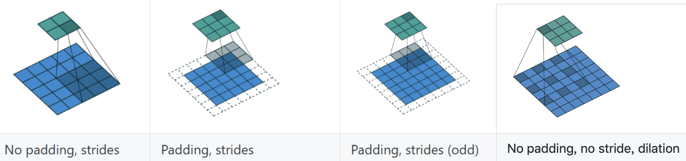

```python
# Applies a 2D convolution over an input signal composed of several input planes.
# torch.nn.Conv2d(in_channels, out_channels, kernel_size, stride=1, padding=0, dilation=1, groups=1, bias=True, padding_mode='zeros', device=None, dtype=None)

# With square kernels and equal stride
m = nn.Conv2d(in_channels=3, out_channels=64, kernel_size=5, stride=2, padding=1)

input = torch.randn(1, 3, 25, 25)	# 3 channel, 25 width, 25 height
print(input.shape)
# torch.size([1, 3, 25, 25])

output = m(input)
print(output.shape)
# torch.size([1, 3, 12, 12])	H_out = (25 + 2 * 1 - 1 * (5 - 1) -1) / 2 + 1 = 12
```

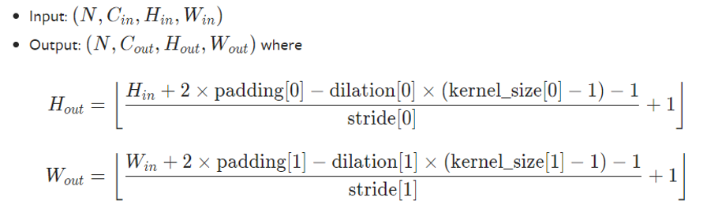

##### Pooling layers

- Pooling is done by applying a pooling filter to (usually) non-overlapping subregions of the initial representation.
- help over-fitting by providing an abstracted form of the representation
- reduces the computational cost by reducing the number of parameters to learn

Max Pooling: `torch.nn.MaxPool2d` ([Doc URL]([https://pytorch.org/docs/stable/generated/torch.nn.MaxPool2d.html#torch.nn.MaxPool2d](https://pytorch.org/docs/stable/generated/torch.nn.MaxPool2d.html)))			Average Pooling: `torch.nn.AvgPool2d` ([Doc URL](https://pytorch.org/docs/stable/generated/torch.nn.AvgPool2d.html#torch.nn.AvgPool2d)))

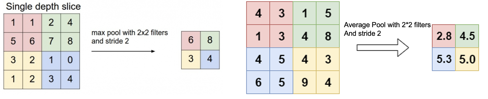

```python
import torch
# torch.nn.MaxPool2d(kernel_size, stride=None, padding=0, dilation=1, return_indices=False, ceil_mode=False)

x = torch.tensor([[[[1., 1., 2., 4.],
									[5., 6., 7., 8.],
									[3., 2., 1., 0.],
									[1., 2., 3., 4.]]]])

print(x.shape)
# torch.size([1, 1, 4, 4])

max_pool = torch.nn.MaxPool2d(2, stride=2)
y = max_pool(x)
print(y)
# tensor([[[[6, 8],
#						[3, 4]]]])

# torch.nn.AvgPool2d(kernel_size, stride=None, padding=0, ceil_mode=False, count_include_pad=True, divisor_override=None)

avg_pool = torch.nn.AvgPool2d(2, stride=2)
y = avg_pool(x)
print(y)
# tensor([[[[3.2500, 5.2500],
#						[2.0000, 2.0000]]]])
```

##### Linear Layer `torch.nn.Linear` (Doc URL: [https://pytorch.org/docs/stable/generated/torch.nn.Linear.html#torch.nn.Linear](https://pytorch.org/docs/stable/generated/torch.nn.Linear.html))

Apply a linear transformation to the incoming data $ Y = xA^T + b$

```python
# torch.nn.Linear(in_features, out_features, bias=True, device=None, dtype=None)

x = torch.randn(5, 10)
print(x. shape)
# torch.size(5, 10)

linear = nn.Linear(in_features=10, out_features=20)
y = linear(x)

print(linear. weight. shape)
# torch.Size([20, 10])
print(y. shape)
# torch.Size([5，20])
```

##### Activation Functions

An activation function is a function that is added into a model to help to learn **complex patterns** in the data.

- keep the value of the output from the neuron restricted to a certain limit.

- add non-linearity into a neural network.

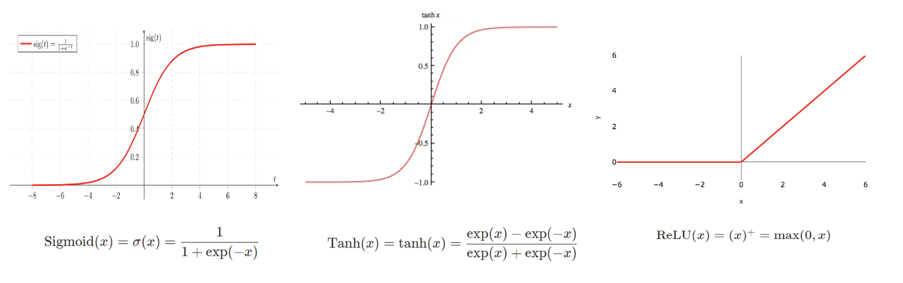

Sigmiod Function: `torch.nn.Sigmoid` ([Doc URL]([https://pytorch.org/docs/stable/generated/torch.nn.Sigmoid.html#torch.nn.Sigmoid](https://pytorch.org/docs/stable/generated/torch.nn.Sigmoid.html))) - Computationally expensive, Causes vanishing gradient problem and not zero-centred. Generally used for **binary classification** problems.

Tanh Function: `torch.nn.Tanh` ([Doc URL]([https://pytorch.org/docs/stable/generated/torch.nn.Tanh.html#torch.nn.Tanh](https://pytorch.org/docs/stable/generated/torch.nn.Tanh.html))) - Solve the problem of non zero-center

ReLU Function: `torch.nn.ReLU` ([Doc URL]([https://pytorch.org/docs/stable/generated/torch.nn.ReLU.html#torch.nn.ReLU](https://pytorch.org/docs/stable/generated/torch.nn.ReLU.html))) - This is a widely used activation function, especially with Convolutional Neural networks. It is easy to compute and does not saturate and does not cause the Vanishing Gradient Problem. It has just one issue of not being zero centred. It suffers from “dying ReLU” problem. Since the output is zero for all negative inputs. It causes some nodes to completely die and not learn anything.

```python
# torch.nn.ReLU(inplace=False) [highly suggest to set the inplace=True to save memory consumption]
import torch

x = torch.randn(2, 3)
# tensor([[-0.9817,  0.6561,  0.4730],
#					[ 0.6870,  1.1721, -0.1561]])

relu = torch.nn.ReLU()

print(relu(x))
# tensor([[0.0000, 0.6561, 0.4730],
#        [0.6870, 1.1721, 0.0000]])
```

##### Build the model with `torch.nn.module` (Doc URL: [https://pytorch.org/docs/stable/generated/torch.nn.Module.html#torch.nn.Module](https://pytorch.org/docs/stable/generated/torch.nn.Module.html))

`torch.nn.module` is the base class for all neural network modules.

- Any models should subclass of this class
- Modules can also contain other Modules, allowing to nest them in a tree structure

```python
import torch
from torch import nn

class MyCNN(nn.Module):
		# Build the model-Define basic modules in __init__().
    def __init__(self):
        super(MyCNN, self).__init__()
				
        self.conv1 = nn.Sequential(nn.Conv2d(3, 64, 5, 1),
                                   nn.ReLU ())
        
				self.max_pool1 = nn.MaxPool2d(3, 2)
        self.conv2 = nn.Sequential(nn.Conv2d(64, 64, 5, 1),
                           				nn.ReLU ())
        
        self.max_pool2 = nn.MaxPool2d(3, 2)
        
        self.fc1 = nn.Sequential(nn.Linear(1024, 384),
                                 nn.ReLU (inplace=True))
                                 
        self.fc2 = nn.Seguential(nn.Linear(384,192),
                                 nn.ReLU (inplace=True))
        
        self.fc3 = nn.Linear(192, 10)
        
		
    # Build the model-Define forward pass in forward().
    def forward(self, x):
				x = self.conv1(x)
        x = self.max_pool1(x)
        x = self.conv2(x)
        x = self.max pool2(x)
        x = x.view(x.shape[0], -1)
        x = self.fc1(x)
        x = self.fc2(x)
				x = self.fc3(x)
				return x
```


#### Step 3: backward pass: Loss function & optimizer

##### Construct loss function

`torch.nn.CrossEntropyLoss` ([Doc URL](https://pytorch.org/docs/stable/generated/torch.nn.CrossEntropyLoss.html#torch.nn.CrossEntropyLoss)) computes the cross entropy loss between input logits and target

```python
# torch.nn.CrossEntropyLoss(weight=None, size_average=None, ignore_index=-100, reduce=None, reduction='mean', label_smoothing=0.0)
import torch

loss_function = torch.nn.CrossEntropyLoss()
loss = loss_function(output, label)
loss.backward()
```


##### Construct Optimizer (Doc URL: https://pytorch.org/docs/stable/optim.html)

Example: `torch.optim.SGD` stochastic gradient descent

- Give it an iterable containing the parameters
- Specify optimizer-specific options such as the learning rate, weight decay, etc.

```python
from torch.optim import SGD

lr = 0.01
optimizer = SGD(model.parameters(), lr=lr)
optimizer.step()
```


##### Construct the training loop

```python
import torch
from torch.optim import SGD
from torchvision import datasets, transforms
from torch.util.data import Dataloader

def train_one_loop(model, dataloader, loss_func, optimizer):
    for idx, (data, label) in enumerate(dataloader):
      # clear the gradients from the last iteration
      optimizer.zero_grad()
      
      # compute model output
      output = model(data)
      # compute the loss
      loss = loss_func(output, label)
      # compute the gradients
      loss.backward()
      # update the model parameters
      optimizer.step()
      
if __name__ == '__main__':
  	# initialize the dataset
    transform = transforms.Compose([
                transforms.RandomVerticalFlip(),
                transforms.RandomVerticalFlip(),
                transforms.ToTensor(),
                transforms.Normalize(mean=0.5, std=0.5)
    ])

    train_dataset = datasets.SVHN(root="./data/’
                                  transform=transform,
                                  split='train'
                                  download=True
    )
    
    # construct the dataloader
    loader_train = DataLoader(dataset=train_dataset,
                          		batch_size=128,
                          		shuffle=True
		)
  	
    # construct the model
    model = MyCNN()
    
    # create the optimizer
    optimizer = SGD(model.parameters(), lr=0.01)
    
    # define the loss function
    loss_func = loss_function = torch.nn.CrossEntropyLoss()
    
    for epoch in range(0, 100):
      train_one_loop(model, loader_train, loss_func, optimizer)
```


##### Save checkpoints: `torch.save` (Doc URL: https://pytorch.org/docs/stable/generated/torch.save.html)

```python
import torch

torch.save(model, 'model.pt')		# save the whole model including structure and weights

torch.save(model.state_dict(), 'model.pt')		# only save the model's weights (suggested)

# save a dict to restore training (suggested)
torch.save({'epoch': epoch + 1,
            'state_dict': model.state_dict(),
            'optimizer' : optimizer.state_dict()}, 
           'checkpoint.pt'
        	)
```


##### Load the checkpoints to restore training `torch.load` (Doc URL: https://pytorch.org/docs/stable/generated/torch.load.html)

```python
import torch

# load everything
checkpoint = torch.load('checkpoint.pt')
start_epoch = checkpoint['epoch']
model.load_state_dict(checkpoint['state_dict'])
optimizer.load_state_dict(checkpoint['optimizer'])
        
```

```python
if __name__ == '__main__':
  	# initialize the dataset
    transform = transforms.Compose([
                transforms.RandomVerticalFlip(),
                transforms.RandomVerticalFlip(),
                transforms.ToTensor(),
                transforms.Normalize(mean=0.5, std=0.5)
    ])

    train_dataset = datasets.SVHN(root="./data/’
                                  transform=transform,
                                  split='train'
                                  download=True
    )
    
    # construct the dataloader
    loader_train = DataLoader(dataset=train_dataset,
                          		batch_size=128,
                          		shuffle=True
		)
  	
    # construct the model
    model = MyCNN()
    
    # create the optimizer
    optimizer = SGD(model.parameters(), lr=0.01)
    
    # define the loss function
    loss_func = loss_function = torch.nn.CrossEntropyLoss()
    
    for epoch in range(0, 100):
      train_one_loop(model, loader_train, loss_func, optimizer)
      torch.save({'epoch': epoch + 1,
            'state_dict': model.state_dict(),
            'optimizer' : optimizer.state_dict()}, 
           f'checkpoint_{epoch}.pt'
        	)
```


#### Model Evaluation

Problem 1: classification task	Problem 2: segmentation task

##### Classification Metrics: `torchmetrics` (Doc URL: https://lightning.ai/docs/torchmetrics/stable/)

`torchmetrics` is a metrics library in PyTorch that provides a collection of metrics for evaluating and monitoring the performance of deep learning models

```shell
# install torchmetrics
pip install torchmetrics
```

```python
import torch

# compute multiclass accuracy
from torchmetrics.classification import Accuracy
target = torch.tensor([0, 1, 2, 3])
preds = torch.tensor([0, 2, 1, 3])
accuracy = Accuracy(task="multiclass", num_classes=4)
accuracy(preds, target)
# tensor(0.5000)

# compute multiclass AUROC
from torchmetrics.classification import AUROC
preds = tensor([[0.90, 0.05, 0.05],
                [0.05, 0.90, 0.05],
                [0.05, 0.05, 0.90],
                [0.85, 0.05, 0.10],
                [0.10, 0.10, 0.80]])
target = tensor([0, 1, 1, 2, 2])
auroc = AUROC(task="multiclass", num_classes=3)
auroc(preds, target)
```

##### Segmentation Metrics: `medpy` (Doc URL: https://loli.github.io/medpy/metric.html) | DICE, ASD, Jaccard

`MedPy` is a Python library that focuses on medical image processing tasks. It provides functionality (including commonly used medical evaluation metrics) for various image processing tasks commonly encountered in medical imaging applications.

```shell
# install medpy
pip install medpy
```

###### DICE Coefficientmedpy.metric.binary.dc ([Doc URL](https://loli.github.io/medpy/reference/generated/medpy.metric.binary.dc.html))

Dice coefficient quantifies the spatial overlap between the predicted segmentation and the ground truth. (1 denotes perfect overlap, 0 denotes no overlap)
$$
DC = \frac{2|A\cap B|}{|A| +|B|}
$$

```python
from medpy.metric.binary import dc
import torch

preds = torch.tensor([[1, 0, 1],
                [1, 0, 1],
                [1, 1, 1],
                [1, 0, 1],
                [1, 1, 1]]).numpy()		# medpy accepts numpy ndarray
                
target = torch.tensor([[1, 1, 1],
                [1, 0, 0],
                [1, 1, 1],
                [0, 0, 1],
                [1, 1, 1]]).numpy()
                
dice = dc(preds, target)
print(dice)
# 0.8695652173913043
```

###### ASD coefficient `medpy.metric.binary.assd`([Doc URL](https://loli.github.io/medpy/reference/generated/medpy.metric.binary.assd.html#medpy.metric.binary.assd))

**ASD (Average Surface Distance)** is a metric that quantifies the average distance between the **surfaces** of the segmented region and the ground truth. 

> ASD = 0 denotes perfect segmentation, ASD > 0 denotes there are still some errors

```python
from medpy.metric.binary import assd
import torch

preds = torch.tensor([[1, 0, 1],
                [1, 0, 1],
                [1, 1, 1],
                [1, 0, 1],
                [1, 1, 1]]).numpy()		# medpy accepts numpy ndarray
                
target = torch.tensor([[1, 1, 1],
                [1, 0, 0],
                [1, 1, 1],
                [0, 0, 1],
                [1, 1, 1]]).numpy()
                
asd = assd(preds, target)
print(asd)
# 0.13043478260869565
```

###### Jaccard coefficient | IoU `medpy.metric.binary.jc` ([Doc URL](https://loli.github.io/medpy/reference/generated/medpy.metric.binary.jc.html))

Similar to DICE, Jaccard coefficient also quantifies the overlap between the segmented region and the ground truth by computing the intersection divided by the union of the two regions. (more sensitive to class-imbalance problem)
$$
JC = \frac{|A\cap B|}{|A \cup B|}
$$

```python
from medpy.metric.binary import jc
import torch

preds = torch.tensor([[1, 0, 1],
                [1, 0, 1],
                [1, 1, 1],
                [1, 0, 1],
                [1, 1, 1]]).numpy()		# medpy accepts numpy ndarray
                
target = torch.tensor([[1, 1, 1],
                [1, 0, 0],
                [1, 1, 1],
                [0, 0, 1],
                [1, 1, 1]]).numpy()
                
jaccard = jc(preds, target)
print(jaccard)
# 0.7692307692307693
```

##### Class Activation Map ([Paper Link](https://arxiv.org/pdf/1512.04150))

- An attention map that reflect the **contribution level** of the classification of certain type - show whether your model focus on the right image regions

- Replace the fully connected layer with global average pooling layer for the feature maps, and pool each feature map into one feature vector

- Apply a linear layer on the features vectors pooled from the feature maps to generate the classification results

- The class activation map is the weighted sum of the feature map (the weight is the parameter of the linear layer)

  > The parameters of the linear layer have stored the contribution of each feature map to the final classification prediction (w1 stores the contribution of the first feature map), the feature map is considered to be the model's attention on the image when making a classification decision

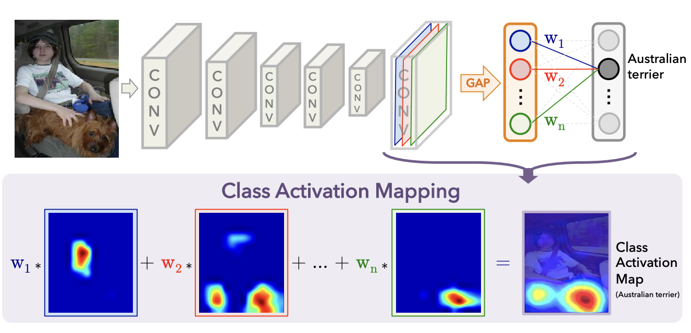

Upgraded version: Gradient Class Activation Map ([Paper](https://arxiv.org/pdf/1610.02391), [Github](https://github.com/jacobgil/pytorch-grad-cam), [Tutorial](https://jacobgil.github.io/pytorch-gradcam-book/introduction.html))

```shell
pip install grad-cam
```


### Medical Data Pre-Processing

#### Quick Look at the medical data

##### Problem 1: **Microscopic Skin Lesion Image** (2D medical image)

- Other 2D medical image: H&E stained whole slide image, Fundus image, X-ray image, etc
- Data format: similar to natural image, JPEG, PNG, TIF, SVS (gigapixel WSI), DICOM (X-ray)

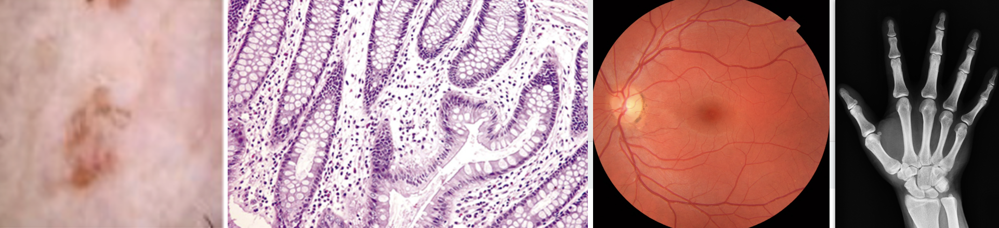

###### Accessing 2D medical data

`Opencv-python` and `Pillow` for reading 2D RGB or gray-scale data

```python
import cv2
image = cv2.imread('./*.png')		# return BGR ndarray

from PIL import Image
image = Image.open('./*.png')		# return RGB PIL.Image object
image - np.asarray(image)
```


##### Problem 2: **Heart Magnetic Resonance Image** (3D medical image)

- Other 3D medical image: Computed Tomography, Optical Coherence Tomography, Positron emission tomography
- Data format: DICOM | .dcm (CT, OCT); NIFTI | .nii.gz (MRI, PET)

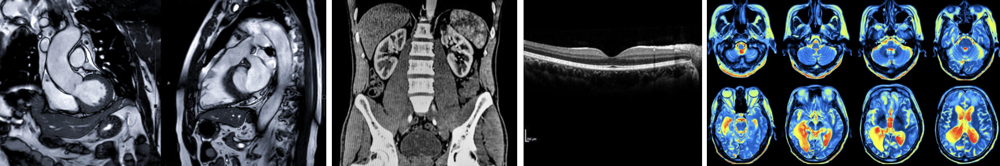

###### Access 3D medical Data

`ITK-SNAP` Software for 3D medical data visualization (URL: http://www.itksnap.org/pmwiki/pmwiki.php)

- Support file format: DICOM | .dcm, NIFTI | .nii.gz

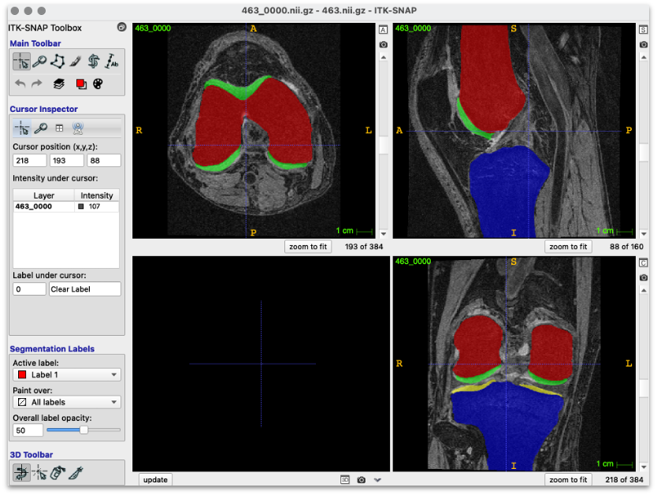

`SimpleITK` for access raw image data in Python (Doc URL: https://simpleitk.readthedocs.io/en/master/gettingStarted.html#python-binary-files)

```shell
pip install SimpleITK
```

```python
import SimpleITK as sitk

# Use SimpleITK to load single DICOM file
dcm_image = sitk.ReadImage('*.dcm')		# load dicom file (.dcm)
dcm_arr = sitk.GetArrayFromImage(dcm_image)    # get numpy ndarray of dcm

# Use SimpleITK to load DICOM series
reader = sitk.ImageSeriesReader( )
dcm_dir = 'xxx/xxx/xxx/'				# get the dir path to the series
dicom_names = reader.GetGDCMSeriesFileNames(dcm_dir)	# get dicom file names
reader.setFileNames(dicom_names)
image = reader.Execute()				# read the whole series
image_array = sitk.GetArrayFromImage(image)		# get numpy ndarray

# Use SimpleITK to load NIFTI
nifti_image = sitk.ReadImage('*.nii.gz')     # load notfi file (.nii/.nii.gz)
nifti_arr = sitk.GetArrayFromImage(nifti_image)    # get numpy ndarray of nifti
```


##### Data Normalization

```python
# normalization for MR Image

# thresh out the lowest 5% and highest 5% to remove the outliers or extreme pixel values
p5 = np.percentile(image.flatten(), 0.5)
p95 = np.percentile(image.flatten(), 99.5)
image = image.clip(min=p5, max=p95)

# min-max normalization
image = (image - image.min()) / (image.max() - image.min())
```

**In problem 2, the data I have provided are preprocessed numpy ndarray, you just need to load them**


##### Customed MRI dataset

```python
class MRIDataset(Dataset):
  	# surrport dataset initialization
    def __init__(self, data_dir, transform):
        """
        - data_dir: str, directory to the data
        - transform: torchvision.transforms object, image transformation
        """
        self.data_dir = data_dir
        self.transform = transform
        self.data_list = []

        for data in os.listdir(data_dir):
            self.data_list.append(os.path.join(data_dir, data)
                                  
		# support to return the size of the dataset
    def __len__(self):
        return len(self.data_list)
                                  
    # supporting fetching a data sample for a given key                              
    def __getitem__(self, idx):
        # get data path
        data_path = self.data_list[idx]
        
        # read data and label
        image, label = self.read_data(data_path)
                                  
        # thresh out the lowest 5% and highest 95% to remove the outliers or extreme pixel values
        p5 = np.percentile(image.flatten(), 0.5)
        p95 = np.percentile(image.flatten(), 99.5)
        image = image.clip(min=p5, max=p95)

        # min-max normalization
        image = (image - image.min()) / (image.max() - image.min())
                                  
        # transform data
        image = self.transform(image)
        
        return image, label
    
  def read_data(self, path):
        nifti_image = sitk.ReadImage(path)     # load nitfi mri file
				nifti_arr = sitk.GetArrayFromImage(nifti_image)    # get numpy ndarray of nifti
        label = #
                                  
        return nifti_arr, label
```


### Details & Head-up of Assignment 1 (Coding Project)

#### Problem 1: Skin Lesion Classification (ISIC 2018 task 3)

Dataset Download: https://challenge.isic-archive.com/data/#2018

- Eight Classes: Melanoma, Melanocytic nevus, Basal Cell Carcinoma, Actinic Keratosis, Benign Keratosis, Dermatofibroma, Vascular Lesion 

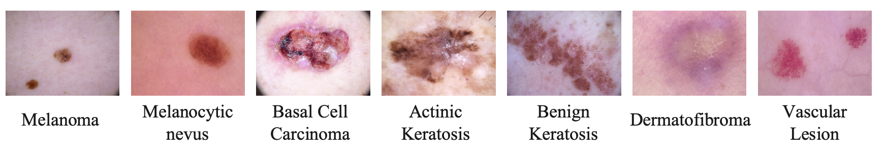

**Semi-supervised learning for using extra training data is allowed (ISIC2019)**

#### Problem 2: Heat MRI Segmentation (LA-Seg)

Pre-processed data (.h5, numpy ndarray) download: https://drive.google.com/drive/folders/12k56k2JCOYtMbA_8BtrlyrFLONUSqqje?usp=sharing

Un-processed raw data (.nrrd) download: https://www.cardiacatlas.org/atriaseg2018-challenge/atria-seg-data/

***Important note: if you fulfill the performance requirement, you will get the full mark, I don't want to raise any competition between the classmates***
